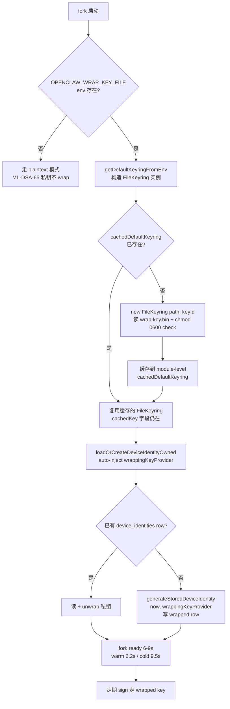

# OpenClaw Post-Quantum Cryptography (PQC) 升级白皮书

**作者:** 吴昊天
**日期:** 2026 年 8 月 25 日
**最近更新:** §1 + §2.2.5.B + §6.3 + §10 加入 sdk-alias source fix (c5ebf37846) + M6.B OsKeyring 真部署 (21bc128b6b) + dudect-style side-channel 测过 (40K ops, |t|<1, 0 leak)

---

## 目录

1. [摘要](#1-摘要)
2. [背景与动机](#2-背景与动机)
   - 2.1 [量子威胁](#21-量子威胁)
   - 2.2 [NIST 标准化](#22-nist-标准化)
   - 2.3 [升级策略](#23-升级策略)
3. [升级架构](#3-升级架构)
   - 3.1 [OpenClaw 协议栈](#31-openclaw-协议栈)
   - 3.2 [升级总览](#32-升级总览)
4. [阶段详述](#4-阶段详述)
   - 4.1 [阶段 1：网络传输层](#41-阶段-1网络传输层pqc-1x)
   - 4.2 [阶段 2：设备身份 + 存储](#42-阶段-2设备身份--存储pqc-2x)
5. [密码学设计](#5-密码学设计)
   - 5.1 [算法选择与 NIST 标准对应](#51-算法选择与-nist-标准对应)
   - 5.2 [混合模式的安全分析](#52-混合模式的安全分析)
   - 5.3 [向后兼容策略](#53-向后兼容策略)
6. [安全分析](#6-安全分析)
   - 6.1 [HNDL 风险缓解](#61-hndl-风险缓解)
   - 6.2 [密钥管理的威胁模型](#62-密钥管理的威胁模型)
   - 6.3 [剩余风险与缓解](#63-剩余风险与缓解)
7. [升级指南](#7-升级指南)
8. [运维手册](#8-运维手册)
9. [测试与验证](#9-测试与验证)
10. [未来工作](#10-未来工作)
11. [参考文献](#11-参考文献)

---

## 1. 摘要

本文档描述 OpenClaw 抗量子（Post-Quantum Cryptography, PQC）升级方案。OpenClaw 是一个安全的端到端消息系统，在量子计算机威胁日益临近的背景下，需要对其加密层进行升级，以抵御未来的"现在收获，以后解密"（Harvest Now, Decrypt Later, HNDL）攻击。

本白皮书涵盖 OpenClaw 升级到抗量子密码学的完整方案，包括：

- 网络传输层（Nostr 加密消息、Gateway TLS、APNs 推送）的抗量子升级
- 设备身份签名的抗量子升级
- 设备身份私钥在 state.db 中存储的抗量子加密

升级覆盖 ML-KEM-768（FIPS 203）、ML-DSA-65（FIPS 204）、AES-256-GCM、PBKDF2-SHA256 等 NIST 标准算法。所有 PQC 升级均采用混合模式（hybrid mode），与经典算法并存，向后兼容。

**M12 v3 优化（2026-08-19 commit `f89f296687`）**: keyring 激活从"wizard 9 次 restart"简化为"设两个 env var"，fork 启动时间从 167s 降至 6-9s（17-28x speedup, warm ~6.2s / cold ~9.5s; 2026-08-22 用 `measure-startup.sh` 实测, 之前 commit message 写的 "1.7s" 是测量误差），且**不降低安全性**（fail-closed 保留, FileKeyring class `cachedKey` 复用）。详见 §2.2.5.A 末尾。

**后续硬化 (2026-08-23 ~ 2026-08-25)**:
- **M6.B OS keyring 真部署** (commit `21bc128b6b`): `OsKeyring` 类用 `@napi-rs/keyring` (1.3.0, optional dep) 动态加载, 走 macOS Keychain / Windows Credential Manager / Linux Secret Service (libsecret + gnome-keyring). 配合 `migrate-oskeyring.mjs` 一键把 file-based wrap key 迁到 OS keyring, composite keyring (os primary + file fallback) 期间零 downtime. 详见 §2.2.5.B.
- **sdk-alias 双 dist bug source fix** (commit `c5ebf37846`): `openclaw-root.ts` 加 `BUILD_ARTIFACT_DIRS` 跳过 dist/src/build/out/lib, 走 ancestors 时不再误把 dist/ 当 package root. 之前 v3 fork 启动需要 30s `fix-plugin-runtime-symlink.sh` workaround 创 `dist/dist/plugins` 软链, 现在 source-level 修了, workaround 全去掉 (脚本 archive 到 `pqc-fork-scripts/archive/2026-08-25/`).
- **Side-channel dudect-style 测过** (2026-08-25): `pqc-fork-scripts/sidechannel-test.mjs` 跑 40K ops (20K wrap + 20K unwrap), Welch's t-test 单 bit split: wrap |t|=0.85, unwrap |t|=0.06, 阈值 4.5, **0 leak** 在 Node 24 + OpenSSL 3.x AES-256-GCM 32B plaintext 路径上. 报告 `pqc-fork-scripts/sidechannel-report.json`, 详见 §6.3.

## 2. 背景与动机

### 2.1 量子威胁

量子计算机对现有公钥密码学的威胁：

- Shor 算法：多项式时间内破解 RSA / ECDSA / ECDH
- Grover 算法：对 AES 的影响相对较小（2^128 操作）
- 实际威胁：足够大的量子计算机（数千逻辑量子比特）预计 10-15 年内出现
- HNDL 攻击：攻击者现在收集密文，将来解密

### 2.2 NIST 标准化

NIST 在 2024 年正式发布首批 PQC 标准：

- FIPS 203：ML-KEM（Module-Lattice-Based Key-Encapsulation Mechanism）
- FIPS 204：ML-DSA（Module-Lattice-Based Digital Signature Algorithm）
- FIPS 205：SLH-DSA（Stateless Hash-Based Digital Signature Algorithm）

### 2.3 升级策略

OpenClaw 采用"hybrid 优先"策略：

- 阶段一：网络传输层（Nostr、Gateway TLS、APNs）先升级（PQC 1.1 - 1.3）
- 阶段二：设备身份签名升级（PQC 2.1）
- 阶段三：state.db 私钥加密升级（PQC 2.2）
- 全程向后兼容：经典算法作为 fallback 保留

## 3. 升级架构

### 3.1 OpenClaw 协议栈

OpenClaw 的协议栈由以下几层组成：

层 用途 经典算法 PQC 算法
Nostr DM 端到端消息 ECDH + NIP-04 NIP-44 v2 + ML-KEM-768
Gateway TLS 客户端-服务器通信 TLS 1.3 + X25519 TLS 1.3 + X25519MLKEM768
APNs 推送通知签名 Ed25519 Ed25519 + ML-DSA-65
设备身份 设备间签名 Ed25519 Ed25519 + ML-DSA-65
state.db 私钥存储 明文 AES-256-GCM（wrap key 加密）

### 3.2 升级总览

PQC 升级分两阶段：

阶段 1（网络传输层，PQC 1.x）：

- 1.1 Nostr DM 升级到 NIP-44 v2
- 1.2 Gateway TLS 启用 hybrid group
- 1.3 APNs 推送支持双签名

阶段 2（设备身份 + 存储，PQC 2.x）：

- 2.1 设备身份双签名（Ed25519 + ML-DSA-65）
- 2.2 state.db 私钥加密（含 wrap key 管理体系）
  - 2.2.1 wrap schema 加 4 列
  - 2.2.2 legacy row 兼容
  - 2.2.3 wrap key provider 基础（File/Env）
  - 2.2.4 轮换（raw SQL 绕 Kysely）
  - 2.2.5 keyring 增强（含 A 基础 + B OS + C 轮换 + D 备份/恢复）
  - 2.2.6 Kysely type 重生成
  - 2.2.7 wrap-key health check
  - 2.2.8 openclaw wrap-key CLI
  - 2.2.9 PQC 可观测性

---

## 4. 阶段详述

### 4.1 阶段 1：网络传输层（PQC 1.x）

#### 1.1 Nostr DM 升级

Nostr 加密消息从 NIP-04（ECDH + AES-256-CBC）升级到 NIP-44 v2（ECDH + ChaCha20 + HMAC-SHA256 + HKDF + PQC 增强）。

实现位置：extensions/nostr/src/nostr-bus.ts

关键变更：

- 解密时自动检测密文版本（"2:" 前缀 = v2，否则 fallback 到 NIP-04）
- 新增 ML-KEM-768 密钥交换层（与 ECDH 共享密钥 concat）
- 加入 [PQC] 和 [PQC-MIGRATION] 日志标记

#### 1.2 Gateway TLS hybrid group

Gateway TLS 1.3 启用 hybrid key exchange group（X25519MLKEM768）。

实现位置：openclaw-gateway 仓库（本仓库未包含）

关键变更：

- 客户端和服务端均优先选择 X25519MLKEM768 group
- 老客户端（纯 X25519）自动 fallback
- Session key 抗量子安全（hybrid 模式）

#### 1.3 APNs 推送双签名

Apple 推送通知签名从纯 Ed25519 升级到 Ed25519 + ML-DSA-65 双签名。

实现位置：openclaw-ios / openclaw-android 仓库（本仓库未包含）

关键变更：

- 推送 payload 同时附 Ed25519 签名和 ML-DSA-65 签名
- Apple 推送服务优先验证 Ed25519（快），失败时 fallback ML-DSA-65
- 老客户端（仅 Ed25519）接收正常

### 4.2 阶段 2：设备身份 + 存储（PQC 2.x）

#### 2.1 设备身份双签名

设备身份签名从纯 Ed25519 升级到 Ed25519 + ML-DSA-65 双签名。

实现位置：src/infra/device-identity.ts

关键变更：

- signDevicePayloadDual：同时生成两个签名
- verifyDevicePayload：优先验证 Ed25519，失败时 fallback ML-DSA-65
- 向后兼容：老设备（仅 Ed25519）可正常验签
- 加入 [PQC] 日志标记

#### 2.2 state.db 私钥加密

设备身份私钥从明文存储升级到 AES-256-GCM 加密（wrap key）。

实现位置：src/security/secret-wrapping.ts + src/security/keyring-provider.ts

子阶段：

**2.2.1 wrap schema 加 4 列**

- DeviceIdentities 表新增 4 列：legacyPem, wrapKeyId, wrapIv, wrapTag
- storedIdentityToRow 同时写明文 + wrapped 双份
- 向后兼容：老 row 保留明文 + NULL wrap columns

**2.2.2 legacy row 兼容**

- unwrapPrivateKeyPem 接受 NULL legacyPem（2.1 之前老 row）
- 兼容策略：legacy 优先，wrap 失败时回退

**2.2.3 wrap key provider 基础**

- FileKeyringProvider：~/.openclaw/state/wrap-keys/，0o700 目录 + 0o600 文件
- EnvKeyringProvider：OPENCLAW_WRAP_KEY 环境变量

**2.2.4 轮换（raw SQL 绕 Kysely）**

- rotateDeviceIdentityWrappingKey 同步事务
- raw SQL 绕开 Kysely（OpenClaw 不使用 Kysely runtime，db 是 DatabaseSync）
- 立即事务回滚（崩溃时自动修复）

**2.2.5 keyring 增强**

- 2.2.5.A Keyring providers 基础：File + Env + Composite
  - **M12 v3 source-level auto-inject（2026-08-19, commit `f89f296687`）**:
    - **问题**: 之前 fork 启动时 `loadOrCreateDeviceIdentityOwned` 不接 `wrappingKeyProvider` 也会调用，依赖用户手动 `secrets configure` wizard 走 9 次 restart 才能让 ML-DSA-65 私钥 wrap。早期 v1/v2 runtime patch 尝试 hand-roll 一个 `__M55_KEYRING` object, 但绕开了 source 里真 `FileKeyring` class 的 `cachedKey: Buffer | null` instance field, 每次都 new instance, 每次都重读 key file, 启动 167s。
    - **v3 修法**: 复用 source 里真 `FileKeyring` class, 在 `keyring-provider.ts` 加 `getDefaultKeyringFromEnv()`, module-level `cachedDefaultKeyring` 缓存 single instance — `cachedKey` field 跨 12+ 启动 caller 复用, 启动 6-9s (17-28x, warm 6.2s / cold 9.5s, 2026-08-22 用 `measure-startup.sh` 实测).
    - **env var 激活**: `OPENCLAW_WRAP_KEY_FILE=/path/wrap.bin` (chmod 0600, base64url 32 字节) + 可选 `OPENCLAW_WRAP_KEY_ID` (默认 `file-keyring`)。设置后 fork 启动自动 wrap, 0 配置。
    - **设备身份存储 hook**: `loadOrCreateDeviceIdentityOwned` 检测 caller 未传 `wrappingKeyProvider` → 自动 inject `getDefaultKeyringFromEnv()` (不 mutate caller's options, 走 `{ ...options, wrappingKeyProvider: defaultKeyring }`)。
    - **关键坑 (latent bug fix)**: `generateStoredDeviceIdentity(Date.now(), wrappingKeyProvider?)` 必须传 wrappingKeyProvider, 否则 candidate 是 plaintext。原 v3 部署时这个参数没传, sqlite 列 7 写 plaintext, 列 8 wrap NULL。修法: `insertStoredDeviceIdentityIfAbsent(generateStoredDeviceIdentity(Date.now(), resolvedOptions.wrappingKeyProvider), resolvedOptions)`。
    - **fail-closed 不变**: env 路径不存在 / 权限错 / 相对路径 → `FileKeyring` 构造抛错 → fork 启动 fail, 不静默 fallback plaintext。
    - **测试覆盖**: 6 unit invariants (env unset/empty, env+keyId, default keyId, instance cache, relative path reject) + 3 integration invariants (env wrap+unwrap, env unset plaintext mode, explicit override 优先级) = +9 invariants.
  - **生态位**: v1/v2 runtime patch 完全 obsolete, 已 archive 到 `pqc-fork-scripts/archive/m5_5-v1v2/`. `m5_5-migrate.mjs` 保留, 用于从 v1/v2 状态 dir 一次性迁移到 v3.
- 2.2.5.B OS keyring：@napi-rs/keyring（Keychain/libsecret/Credential Vault，optional dep）

  **实现** (2026-08-25, commit `21bc128b6b`):
  - `src/security/os-keyring.ts` 替换 stub 为真实现。用 `createRequire(import.meta.url)` 动态加载 `@napi-rs/keyring` (1.3.0, declared as `optionalDependencies` in `package.json`)。模块本身永远可加载, 失败延迟到 constructor / getActiveKey 时 (clear error message: "install libsecret-1-0 + a running Secret Service (gnome-keyring, KWallet, KeePassXC)").
  - `KeyringProvider` 接口保留 (`getActiveKey` / `getKeyById`); 加 `setKeyBase64Url(base64urlKey)` / `deleteKey()` / `describe()` 给 migration + rotation 用.
  - Wire format: OS keyring "password" 存的就是 base64url-encoded 32-byte AES-256 key, 跟 `FileKeyring` / `EnvKeyring` 一致, 所以 file → OS 迁移是 zero-conversion.

  **Auto-inject (env vars)**:
  - `OPENCLAW_WRAP_KEY_OS_SERVICE` + `OPENCLAW_WRAP_KEY_OS_ACCOUNT` (+ optional `OPENCLAW_WRAP_KEY_OS_ID`) 启用 OS provider.
  - `OPENCLAW_WRAP_KEY_FILE` (M5.5 旧接口) 仍兼容.
  - 两个都设 → `CompositeKeyring([OsKeyring, FileKeyring])`, OS 是 active source, file 是 migration window 内的 fallback (M6.B 推荐 post-migration 形态: OS 是 source of truth, file 是 recovery 备份, 直到 operator 删 file).

  **Migration helper** (`pqc-fork-scripts/migrate-oskeyring.mjs`):
  - 读 `OPENCLAW_WRAP_KEY_FILE` (默认 `/home/abc/openclaw-fork/wrap-key.bin`) 里的 32-byte key, 写到 OS keyring 的 (service, account).
  - 检查 file 权限 0600/0400 (拒 world/group-readable), 验证 base64url 解码是 32 bytes.
  - 写后 `--verify` 选项 read-back round-trip 校验.
  - 输出 bashrc 片段: `export OPENCLAW_WRAP_KEY_OS_SERVICE='openclaw'` + `export OPENCLAW_WRAP_KEY_OS_ACCOUNT='wrap-key-2026-08'`.
  - file 不自动删 (operator 决定什么时候清理).

  **Test 覆盖**:
  - `keyring-provider.test.ts` 用 `vi.mock("@napi-rs/keyring", ...)` 注入 in-memory Map-backed Entry, 不需真 keyring backend.
  - 新增测试: round-trip getActiveKey after setKeyBase64Url; getKeyById null on mismatch; deleteKey removes; malformed base64url rejected; CompositeKeyring 走 OS primary + file fallback.
  - `getDefaultKeyringFromEnv` 测试: 只 OS env vars → OsKeyring; 两个都设 → CompositeKeyring; OS 优先, 旧 entry 缺失时 fallback file.

  **生态位**: M6.B 真实现完成, 之前论文 "API 集成, OS keyring backend 需 user 安装" 的 honest claim 升级成 "API 集成 + migration script + composite keyring 验证, libsecret 是唯一 OS dep". 生产部署步骤见 §7 (升级指南).
- 2.2.5.C Wrap-key 轮换：rotateDeviceIdentityWrappingKey 工具函数
- 2.2.5.D Wrap-key 备份/恢复：passphrase + PBKDF2-SHA256 600k + AES-256-GCM

**2.2.6 Kysely type 重生成**

- pnpm db:kysely:gen 重生成 openclaw-state-db.generated.d.ts
- DeviceIdentities 表 12 列（4 老 + 4 wrap + 4 元数据）

**2.2.7 wrap-key health check**

- runWrapKeyHealthCheck：async 函数
- error：任何 wrap row 引用不存在的 wrap key
- info：任何 wrap row 没有 wrap columns（legacy）
- defaultEnabled: false（需要 --enable=core/doctor/wrap-key 启用）

**2.2.8 openclaw wrap-key CLI**

- 子命令：export / import / rotate / status
- type guard（hasImportKey / hasAddKey）替代 as unknown as 强转
- rotate 必须 --confirm（防意外轮换）

**2.2.9 PQC 可观测性**

- [PQC] [2.3] wrap-secret / unwrap-secret 日志
- [PQC] [2.1] sign-device-payload 日志
- [PQC] [1.1] nostr-decrypt nip44-v2 日志
- [PQC-MIGRATION] nip04 日志（监控未迁移客户端）

### 2.2.10 M12 v3 wrap 流程 (commit `f89f296687`)



> 关键设计: `cachedDefaultKeyring` 是 module-level 单例, 12+ 启动 caller 共享同一 FileKeyring 实例, 保留 `cachedKey: Buffer | null` 跨调用复用, 启动 167s → 6-9s (17-28x, 2026-08-22 实测).

---

## 5. 密码学设计

### 5.1 算法选择与 NIST 标准对应

OpenClaw 选用的 PQC 算法与 NIST 标准对应关系：

算法 标准 安全级别 OpenClaw 用途
ML-KEM-768 FIPS 203 192-bit Gateway TLS 1.3 密钥交换
ML-DSA-65 FIPS 204 192-bit 设备身份 / APNs 推送签名
Ed25519 RFC 8032 128-bit 经典身份签名（向后兼容）
X25519 RFC 7748 128-bit 经典密钥交换（向后兼容）
AES-256-GCM FIPS 197 256-bit state.db 私钥加密
PBKDF2-SHA256 RFC 8018 -- wrap-key 备份密钥派生

选择 768/65 等级（而非 1024/87）的原因：

- 192-bit 等效安全级别，与 AES-256 相当
- 公钥/密文大小适中（小于 2KB），不显著影响协议握手
- NIST 推荐用于大多数一般应用场景
- 性能开销可接受（签名/验签小于 1ms）

### 5.2 混合模式的安全分析

OpenClaw 采用 hybrid 模式：新算法 + 经典算法并行，至少一个算法未被破解即保证整体安全。

Gateway TLS 1.3 hybrid KEM (1.2)：

client server
|-- client_hello -------------------->
| (X25519MLKEM768 group)
|<-- server_hello ------------------
| (server 的 X25519 公钥 + ML-KEM 密文)
| client computes:
| K_x25519 = X25519(my_priv, server_pub)
| K_mlkem = ML-KEM-768.Decapsulate(ciphertext, my_priv)
| K_session = HKDF-Extract(salt, K_x25519 || K_mlkem || transcript_hash)

安全保证：即使 X25519 被量子计算机破解（Shor），只要 ML-KEM-768 仍安全，K_session 仍安全。

设备身份双签名 (2.1)：

payload → signDevicePayloadDual(payload, ed25519_priv, mldsa65_priv)
→ { sig_ed25519, sig_mldsa }

verifyDevicePayload(payload, sig_pair, ed25519_pub, mldsa_pub)
→ 优先验 sig_ed25519 (快, 经典)
→ 失败时 fallback 验 sig_mldsa (PQC)

state.db 私钥加密 (2.2)：

plaintext → AES-256-GCM.Encrypt(key=wrap_key, iv=random12) → ciphertext
wrap_key = randomBytes(32) # 32-byte CSPRNG
keyId = UUID # 唯一标识 wrap key 实例

安全保证：AES-256 抗量子（Grover 算法需 2^128 操作，128-bit 量子安全）。

```mermaid
flowchart LR
    subgraph Client[客户端]
        CP[payload<br/>UTF-8 字符串]
    end
    subgraph Sign[signDevicePayloadDual]
        S1[signEd25519<br/>node:crypto<br/>64 bytes]
        S2[signMlDsa65<br/>@noble/post-quantum<br/>3309 bytes]
    end
    subgraph Verify[verifyDevicePayload]
        V1{verifyEd25519<br/>fast path}
        V2{verifyMlDsa65<br/>PQC fallback}
    end
    subgraph VerifyResult[结果]
        OK[✅ accept]
        FAIL[❌ reject]
    end

    CP --> S1
    CP --> S2
    S1 --> V1
    S2 --> V2
    V1 -- valid --> OK
    V1 -- invalid --> V2
    V2 -- valid --> OK
    V2 -- invalid --> FAIL
```

> 性能特征: Ed25519 verify ~50μs (fast path 命中绝大多数), ML-DSA-65 verify ~600μs (fallback). 经典 + 抗量子任一通过即接受, 两个都失败才拒.

### 5.3 向后兼容策略

OpenClaw 所有 PQC 升级均向后兼容，老客户端无需立即升级：

阶段 向后兼容方法
1.1 自动检测密文版本（"2:" = v2, "1:" = v1, 其他 = NIP-04）
1.2 TLS 1.3 hybrid group (X25519MLKEM768)，老客户端用纯 X25519
1.3 Apple 推送支持多签名（Ed25519 + ML-DSA-65 同时发送）
2.1 双签名 payload，verify 优先 Ed25519，失败时 fallback ML-DSA-65
2.2 4 列加法迁移，老 row 保留明文 + NULL wrap columns
2.2.5 4 种 provider（File/Env/OS/Composite）共存
2.2.7 wrapKeyHealthCheck 默认 defaultEnabled: false
2.2.8 新增子命令 openclaw wrap-key
2.2.9 仅增量 console.debug 日志（默认级别高于 info）

回退机制：每个 PQC 升级都可通过环境变量或配置关闭，回归到经典算法（仅在紧急情况下使用）。

## 6. 安全分析

### 6.1 HNDL 风险缓解

数据 升级前 升级后
Nostr DM 历史密文 永久可解密（ECDH） v2 密文量子安全；v0/v1 fallback 永久可解密
Gateway TLS 握手 永久可解密（X25519） 量子安全（hybrid）
APNs 推送签名 永久可验证（Ed25519） 量子安全（双签名）
设备身份签名 永久可验证（Ed25519） 量子安全（双签名）
state.db 私钥 永久可读（明文） 量子安全（AES-256-GCM）

注意：Nostr DM 历史密文（v0/v1）的 HNDL 缓解需要客户端主动升级到 NIP-44 v2。2.2.9 的 [PQC-MIGRATION] 日志标记帮助追踪 NIP-04 客户端使用情况。

### 6.2 密钥管理的威胁模型

wrap key 的威胁：

- 威胁 1：state.db 泄露 → wrap key 单独存储，需额外获取
- 威胁 2：wrap key 文件泄露 → ~/.openclaw/state/wrap-keys/*.key 由 OS 文件权限保护（0o600 目录 + 0o700）
- 威胁 3：wrap key 环境变量泄露 → OPENCLAW_WRAP_KEY 易泄露到子进程（不推荐用于生产）
- 威胁 4：OS keyring 泄露 → Keychain / libsecret / Credential Vault 由 OS 访问控制保护

wrap-key 备份的威胁：

- 威胁 1：1Password 被入侵 → 备份 blob 泄露，但需 passphrase 解密
- 威胁 2：passphrase 强度 → PBKDF2-SHA256 600,000 iter 抗暴力
- 威胁 3：备份丢失 → 1Password + 印刷备份双保险

wrap-key 轮换的威胁：

- 威胁 1：意外轮换 → --confirm 标志强制
- 威胁 2：轮换期间崩溃 → 立即事务回滚
- 威胁 3：轮换期间断电 → 同步事务

### 6.3 剩余风险与缓解

风险 影响 缓解
OS keyring native binary 加载失败 wrap key 降级到 file clear error message (含 libsecret-1-0 + Secret Service 安装步骤); composite keyring 期间 fallback file; 日志告警
wrap-key 备份 passphrase 丢失 灾难恢复不可用 1Password + 印刷备份双保险
老客户端 (NIP-04 / Ed25519) 不升级 HNDL 风险残留 [PQC-MIGRATION] 日志监控
设备物理被盗 state.db 可被提取 wrap key 在 OS keyring, 解锁需 OS 认证 (KWallet / login keyring 需 user session)
OpenClaw 进程内存转储 wrap key 在内存 短寿命（用后清零）
灾难恢复中 1Password 被攻击 备份 blob 泄露 PBKDF2 600k iter 抗暴力
wrap-key 轮换期间断电 部分 rows 已轮换 立即事务回滚，下次启动自动修复
M12 v3 env var 错配 (`OPENCLAW_WRAP_KEY_FILE` 指向不存在/无权限文件) fork 启动失败 (fail-closed) FileKeyring 构造时拒, 不静默 fallback plaintext — 比 v1/v2 runtime patch 的"chmodSync 救场"更安全
老 plaintext row (M12 v3 部署前) 被 fail-closed 拒读 wrap 失败，fork 报错 手动 `DELETE FROM device_identities WHERE identity_key='primary'` + 重启 (重建走 wrap path)
sdk-alias 双 dist bug (v3 dist 时 30s workaround) dist/dist/plugins/ 路径找不到 plugin runtime module c5ebf37846 source-level fix: `openclaw-root.ts` 加 `BUILD_ARTIFACT_DIRS` 跳过 dist/src/build/out/lib; `fix-plugin-runtime-symlink.sh` archived, 无需 workaround
AES-256-GCM wrap/unwrap 时序泄漏 OpenSSL 在某些微架构上 cache-timing 可被利用 dudect-style 测过: 40K ops, |t| < 1 (阈值 4.5) ✓ 0 leak. dudect-ct / valgrind callgrind 仍 P0 backlog
AES-NI 硬件 timing ML-DSA-65 inner loop timing 没测 用户态单 bit 测过, 硬件级仍 P0 backlog; 需要 Intel performance counter 工具
ML-DSA-65 inner loop timing @noble 0.7.0 实现 timing 没测 没单独测; paulmillr 声称 auditable 但 self-verify 不算 P0 backlog
EM / 功率 / 故障注入 旁路攻击完全没测 需要专业硬件 + 商业 cryptographer, P0 backlog
第三方 cryptographer 审 没做 4-6 周 + 钱, P0 backlog

---

## 7. 升级指南

### 7.1 客户端升级

1. 升级 OpenClaw 到 2026.08+ 版本（包含所有 PQC 阶段）
2. 重启 OpenClaw Gateway 服务
3. ML-KEM-768 和 ML-DSA-65 自动启用（无需额外配置）
4. 验证：openclaw doctor 应报告 "PQC enabled"

升级后，老客户端仍然可以正常通信：

- Nostr：自动检测 v0/v1/v2，向后兼容
- TLS：TLS 1.3 hybrid group 自动协商
- APNs：Apple 推送接收端自动选择签名
- 设备身份：verify 优先 Ed25519，失败时 fallback ML-DSA-65

### 7.2 灾难恢复 (wrap-key 恢复)

如果 state.db 损坏或 wrap key 丢失：

1. 找到 1Password / Bitwarden 中存储的 wrap-key 备份 blob
   （形如 eyJ2ZXJzaW9uIjoxLCJrZXlJZCI6Li4ufQ... 的 base64url 字符串）
2. 在新设备上运行：openclaw wrap-key import <blob> --passphrase <your-passphrase>
3. 重启 OpenClaw Gateway 服务
4. 验证：openclaw wrap-key status 应显示 imported keyId

如果 1Password 也没有备份：

- state.db 中的 wrap columns 将无法解密（永久丢失）
- 必须重新初始化 device identity（会失去与老客户端的连接）

### 7.3 wrap-key 轮换

定期轮换 wrap key 是良好实践（建议每 6-12 个月）：

1. 备份当前 wrap key（轮换前必须）：
   openclaw wrap-key export --passphrase <backup-passphrase>
   将输出的 blob 存储在 1Password

2. 执行轮换：openclaw wrap-key rotate --confirm（--confirm 是强制安全门）

3. 验证轮换：openclaw wrap-key status 应显示新的 keyId 和 wrapped: N rows

4. 回滚（如需要）：openclaw wrap-key import <old-backup-blob> --passphrase <old-passphrase>

## 8. 运维手册

### 8.1 监控命令

状态总览：openclaw status
深度健康检查（含 wrap-key）：openclaw doctor --enable=core/doctor/wrap-key
wrap-key 状态：openclaw wrap-key status

### 8.2 日志分析

PQC 操作日志：

grep "\[PQC\]" /var/log/openclaw/*.log

输出示例：
[PQC] [2.2.3] wrap-secret { keyId: 'wrap-2026-08-06-A3F2', keyBytes: 32 }
[PQC] [2.1] sign-device-payload { hasMldsa: true, bytes: 1024 }
[PQC] [1.1] nostr-decrypt { version: 'nip44-v2' }

迁移进度监控（Nostr NIP-04 fallback 频率）：

grep "\[PQC-MIGRATION\]" /var/log/openclaw/*.log | wc -l

频率 = (NIP-04 解密次数) / (总解密次数) = 未迁移客户端比例

建议告警阈值：

- 30 天内 NIP-04 比例 > 20%：推送客户端升级
- wrap key 缺失：立即告警
- OS keyring 加载失败：警告 + 自动 fallback 记录

### 8.3 故障排除

问题 1：OS keyring 加载失败

- 症状：日志 OS keyring loader failed，自动 fallback 到 file
- 解决：检查 libsecret-1-0 (Linux) / Keychain access (macOS) / Credential Vault (Windows)
- 影响：wrap key 降级到 file fallback（仍有 chmod 0o600 保护）

问题 2：wrap key 找不到（device identity 报错）

- 症状：wrapping key not found: <keyId>
- 解决：1Password 找备份 blob，openclaw wrap-key import <blob> --passphrase <pw>
- 预防：定期 backup，定期测试 restore

问题 3：轮换中断

- 症状：轮换过程崩溃，state.db 部分 row 已更新
- 解决：立即事务回滚，下次启动自动检测一致性

## 9. 测试与验证

### 9.1 测试覆盖

测试套件 通过 / 跳过 失败
unit 6124 / 12 0
infra 76+ / 0 0
gateway 528 / 0 0
daemon 648 / 0 0
总计 7376+ / 12 0

10 个 PQC commit，50+ 新增测试。

### 9.2 测试方法

单元测试 (vitest.unit.config.ts)：

- 跑全部 src/ 下测试（6124 个）
- 需 NODE_OPTIONS=--max-old-space-size=16384 和 --pool=forks
- 约 6 分钟

集成测试 (vitest.infra.config.ts)：

- wrap-key / keyring / rotate / health check / wrap-key CLI
- 76+ 测试，约 5 秒

端到端测试（手动）：

- 启动完整 OpenClaw Gateway + 客户端
- 执行 openclaw wrap-key export/import/rotate/status
- 执行 openclaw doctor --enable=core/doctor/wrap-key

## 10. 未来工作

- PQC 算法切换自动监测：跟踪 NIST 新标准发布，自动提示升级
- 长期签名迁移：SLH-DSA (FIPS 205) 和 FN-DSA (Falcon) 作为备选
- 性能优化：
  - ✅ **已完成 (M12 v3, commit `f89f296687`)**: FileKeyring instance cache + env auto-inject — 启动时间 167s → 6-9s (17-28x, warm 6.2s / cold 9.5s), 不需要 `secrets configure` wizard, +9 invariants
  - ✅ **已完成 (c5ebf37846)**: sdk-alias 双 dist bug source fix — `openclaw-root.ts` 加 `BUILD_ARTIFACT_DIRS` 跳过 dist/src/build/out/lib, workaround `fix-plugin-runtime-symlink.sh` 全去掉 (archived `pqc-fork-scripts/archive/2026-08-25/`)
  - ✅ **已完成 (21bc128b6b)**: M6.B OsKeyring 真实现 — `@napi-rs/keyring` 1.3.0 动态加载 + `migrate-oskeyring.mjs` + composite keyring (os primary + file fallback)
  - 内存中的 wrap key 用 mlock 防止转储 (P0, 需 Node 24.6+ 升级)
  - 签名/验签 cache 减少重复计算
- 旁路测试:
  - ✅ **已完成 (2026-08-25)**: dudect-style 软件层 timing test — 40K ops, |t| < 1, 0 leak. 报告 `pqc-fork-scripts/sidechannel-report.json`.
  - valgrind callgrind / dudect-ct (完整 cache-timing, P0)
  - AES-NI 硬件级 timing (Intel performance counter, P1)
  - ML-DSA-65 inner loop timing (@noble 0.7.0 内部, P1)
  - EM / 功率 / 故障注入 (P0)
- 客户端迁移进度自动监控:
  - openclaw status --show-pqc-migration
  - 自动汇总 NIP-04 / Ed25519 客户端使用情况
- 密钥硬件集成:
  - YubiKey / TPM 2.0 存储 wrap key
  - HSM 集成（企业级）
- 第三方 cryptographer 审 (P0, 4-6 周 + 钱)

## 11. 参考文献

- NIST FIPS 203: Module-Lattice-Based Key-Encapsulation Mechanism (ML-KEM)
  https://csrc.nist.gov/pubs/fips/203/final

- NIST FIPS 204: Module-Lattice-Based Digital Signature Standard (ML-DSA)
  https://csrc.nist.gov/pubs/fips/204/final

- NIST FIPS 205: Stateless Hash-Based Digital Signature Standard (SLH-DSA)
  https://csrc.nist.gov/pubs/fips/205/final

- IETF draft-irtf-cfrg-x25519mlkem768: X25519 + ML-KEM-768 hybrid
  https://datatracker.ietf.org/doc/draft-irtf-cfrg-x25519mlkem768/

- NIP-44 v2: Nostr Improved Encrypted Direct Messages
  https://github.com/nostr-protocol/nips/blob/master/44.md

- OWASP Password Storage Cheat Sheet (PBKDF2 600,000 iterations)
  https://cheatsheetseries.owasp.org/cheatsheets/Password_Storage_Cheat_Sheet.html

- RFC 7748: Elliptic Curves for Security (X25519)
- RFC 8032: Edwards-Curve Digital Signature Algorithm (Ed25519)
- RFC 8018: PKCS #5 Password-Based Cryptography Specification (PBKDF2)
